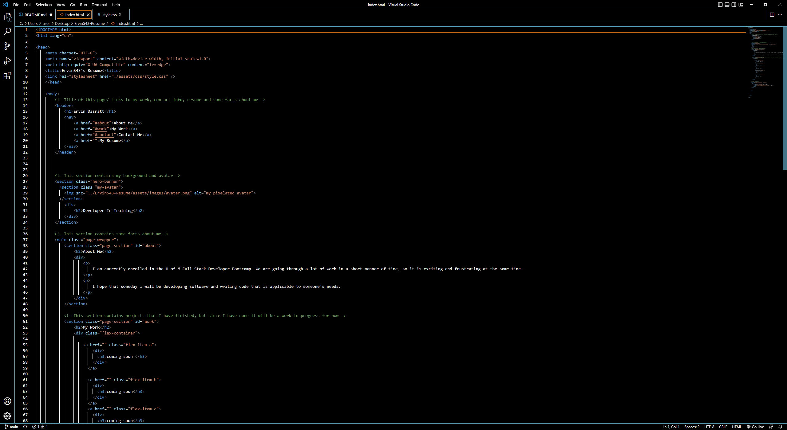
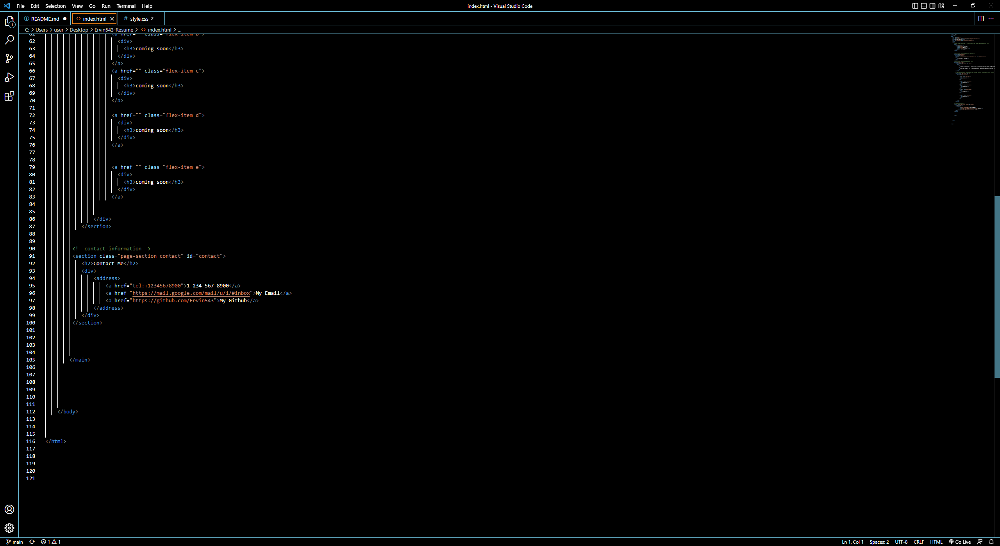
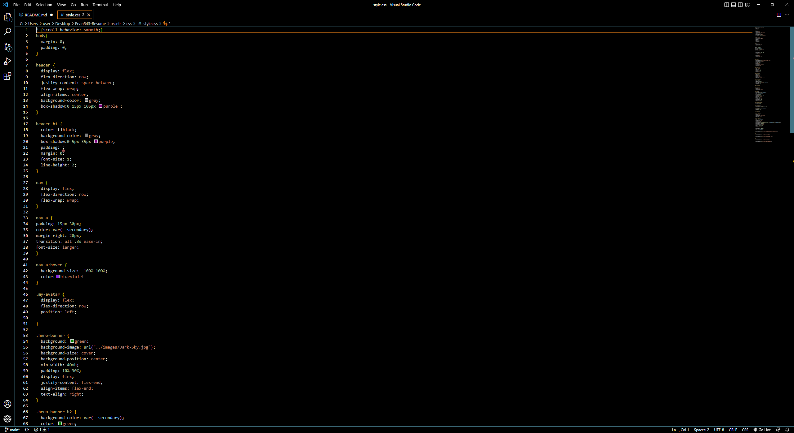
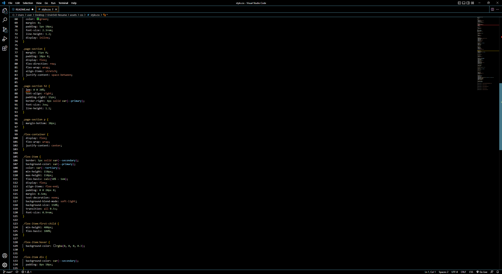
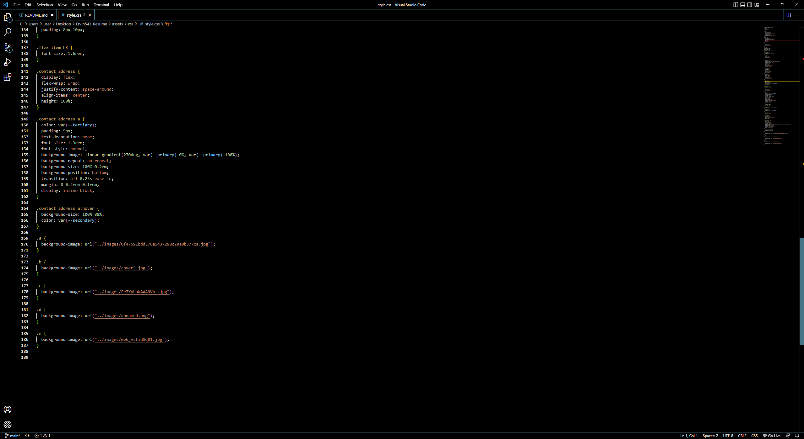
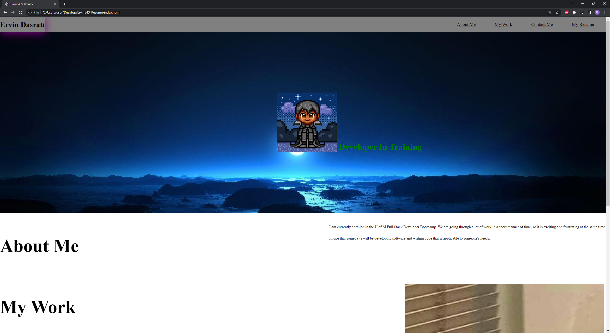
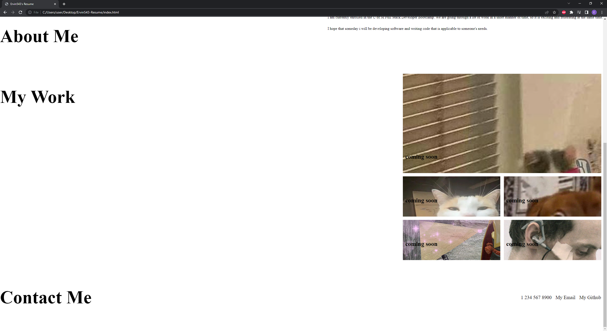

# Ervin543-Resume
This repo contains an HTML and associating code that I used to create an appealing resume for a potential Employer.

Attached below are screenshots of my HTML, CSS and WEBPAGE

Below are the links to my Repository and Live site

Repository: https://github.com/Ervin543/Ervin543-Resume

Live Site: https://ervin543.github.io/Ervin543-Resume/
